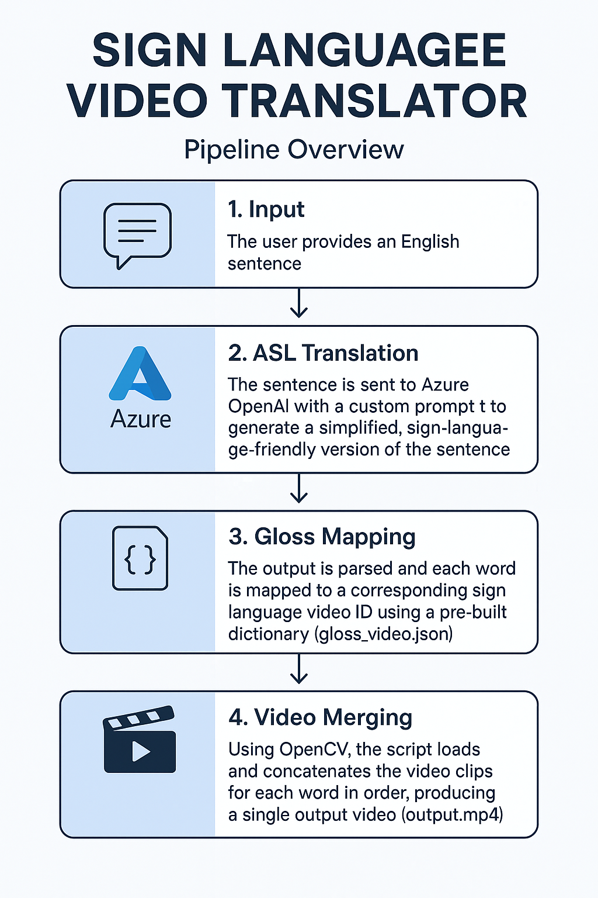

# Sign Language Video Translator

This project converts English text into sign language videos by utilizing Azure OpenAI for text processing and a dataset of sign language video clips. The system automatically selects and merges relevant video clips to create a continuous sign language video for any given input sentence.

## Pipeline Overview




1. **Input**: The user enters an English sentence.
2. **Prompting**: The sentence is sent to Azure OpenAI with a custom prompt to generate a simplified, sign-language-friendly version. If the output contains words not in the dictionary, a secondary LLM agent reviews and corrects it.
3. **Gloss Mapping**: Each word in the output is mapped to a corresponding sign language video ID using a pre-built dictionary (`gloss_video.json`).
4. **Video Clips Merging**: The script loads and concatenates the video clips for each word in sequence, producing a single output video (`output.mp4`).
5. **Playback**: The final video is played back for the user.


## File Structure

- `main.py` — Main script for translation and video generation.
- `prompt` — System prompt for Azure OpenAI to guide translation.
- `./sign_clips/` — Directory of individual sign language video clips. Download the sample dataset from [Kaggle](https://www.kaggle.com/datasets/sttaseen/wlasl2000-resized/data). This dataset is not licensed for commercial use; for commercial purposes, use a different dataset.
- `gloss_video.json` — Dictionary mapping words/glosses to video IDs from the wlasl2000 dataset.
- `streamlit_app.py` — Streamlit web app and its README.

## Requirements

- Python 3.8+
- Packages: `moviepy`, `numpy`, `openai`, `streamlit`

Install dependencies:
```bash
pip install moviepy numpy openai streamlit
```

- Azure OpenAI Deployment:
Add the following env variables - "ENDPOINT_URL" , "DEPLOYMENT_NAME", "AZURE_OPENAI_API_KEY"

- Sign videos dataset:
Download videos into "sign_clips" folder. You can find the data here: [wlasl2000](https://www.kaggle.com/datasets/sttaseen/wlasl2000-resized/data. 

## Usage

### Command Line

1. Set your English sentence in the `input_text` variable in `main.py`.
2. Run:
   ```bash
   python main.py
   ```
3. The output video will be saved as `output.mp4` and played automatically.

### Streamlit Web App

1. From the project root, run:
   ```bash
   streamlit run streamlit_app.py
   ```
2. Enter your English sentence in the web interface and click "Translate and Generate Video" to view the result in your browser.

## Notes

- Translation quality depends on the prompt and the coverage of `gloss_video.json`.
- If a word is missing from the dictionary, the script retries translation.
- Video merging is handled by moviepy.

## Customization

- Edit the `prompt` file to adjust how the model simplifies or translates English to sign language gloss.
- Add more video clips and update `gloss_video.json` to expand vocabulary.

---

## Disclaimer

The sample dataset [wlasl2000](https://www.kaggle.com/datasets/sttaseen/wlasl2000-resized/data) is not licensed for commercial use. For commercial applications, use a different dataset.


**Author:** Mohamad Al jazaery
